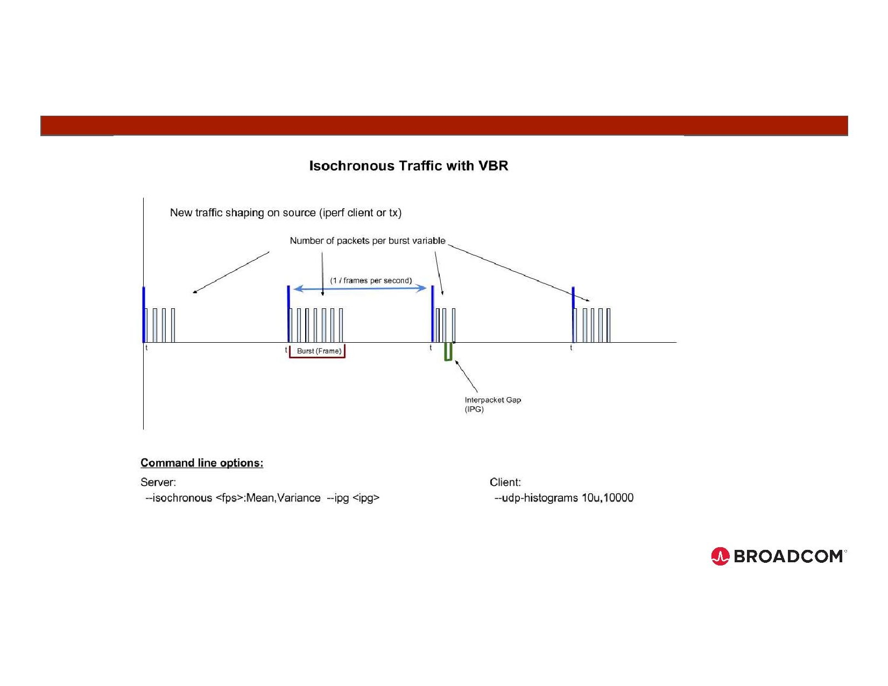
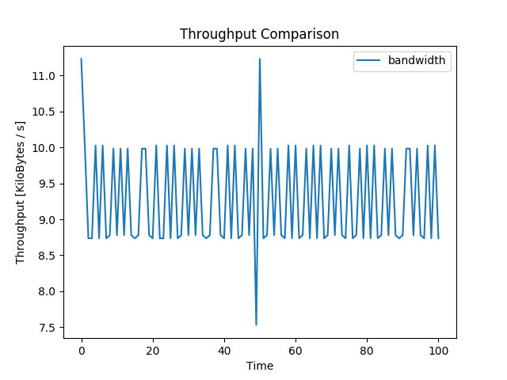
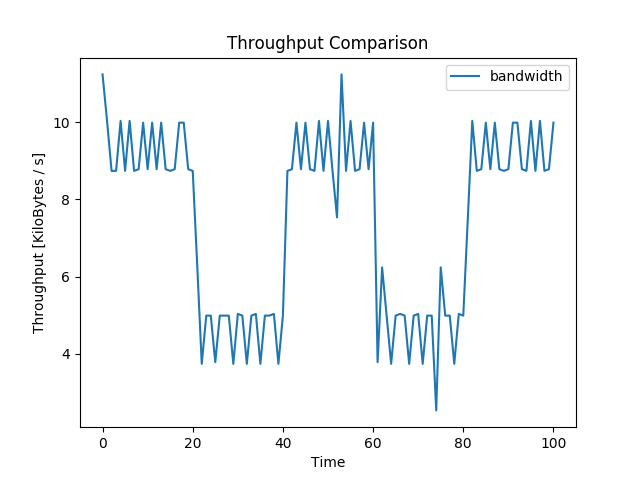
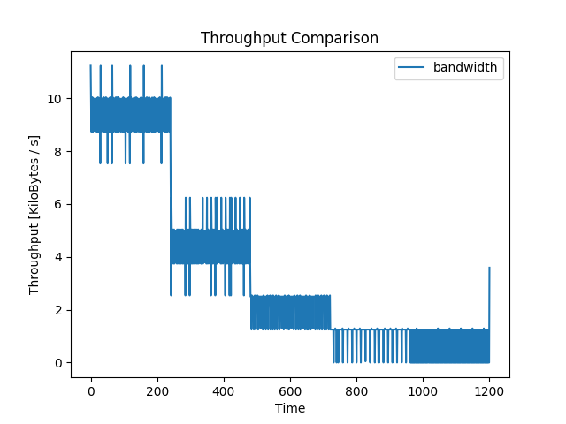

# List of experiments conducted

## iPerf2 experiments:
- Experiment to test UDP throughput between hosts.<br/>

|  | 
|:--:| 
| *iPerf2 UDP throughput test* |

### Experiment - 1
#### Server side:
```console
vagrant@switch:~$ iperf -s -u -l 1248b -f K -w 64k -n 500K -i 1
------------------------------------------------------------
Server listening on UDP port 5001
Receiving 1248 byte datagrams
UDP buffer size:  128 KByte (WARNING: requested 64.0 KByte)
------------------------------------------------------------
[  3] local 192.168.1.102 port 5001 connected with 192.168.1.103 port 52137
[ ID] Interval       Transfer     Bandwidth        Jitter   Lost/Total Datagrams
[  3]  0.0- 1.0 sec  19.5 KBytes  19.5 KBytes/sec   0.150 ms    0/   16 (0%)
[  3]  1.0- 2.0 sec  19.5 KBytes  19.5 KBytes/sec   0.257 ms    0/   16 (0%)
[  3]  2.0- 3.0 sec  19.5 KBytes  19.5 KBytes/sec   0.252 ms    0/   16 (0%)
[  3]  3.0- 4.0 sec  19.5 KBytes  19.5 KBytes/sec   0.296 ms    0/   16 (0%)
[  3]  4.0- 5.0 sec  19.5 KBytes  19.5 KBytes/sec   0.288 ms    0/   16 (0%)
[  3]  5.0- 6.0 sec  19.5 KBytes  19.5 KBytes/sec   0.392 ms    0/   16 (0%)
[  3]  6.0- 7.0 sec  19.5 KBytes  19.5 KBytes/sec   0.364 ms    0/   16 (0%)
[  3]  7.0- 8.0 sec  19.5 KBytes  19.5 KBytes/sec   0.299 ms    0/   16 (0%)
[  3]  8.0- 9.0 sec  19.5 KBytes  19.5 KBytes/sec   0.316 ms    0/   16 (0%)
[  3]  9.0-10.0 sec  19.5 KBytes  19.5 KBytes/sec   0.287 ms    0/   16 (0%)
[  3] 10.0-11.0 sec  19.5 KBytes  19.5 KBytes/sec   0.287 ms    0/   16 (0%)
[  3] 11.0-12.0 sec  19.5 KBytes  19.5 KBytes/sec   0.281 ms    0/   16 (0%)
[  3] 12.0-13.0 sec  19.5 KBytes  19.5 KBytes/sec   0.310 ms    0/   16 (0%)
[  3] 13.0-14.0 sec  19.5 KBytes  19.5 KBytes/sec   0.366 ms    0/   16 (0%)
[  3] 14.0-15.0 sec  19.5 KBytes  19.5 KBytes/sec   0.329 ms    0/   16 (0%)
[  3] 15.0-16.0 sec  19.5 KBytes  19.5 KBytes/sec   0.367 ms    0/   16 (0%)
[  3] 16.0-17.0 sec  19.5 KBytes  19.5 KBytes/sec   0.321 ms    0/   16 (0%)
[  3] 17.0-18.0 sec  19.5 KBytes  19.5 KBytes/sec   0.360 ms    0/   16 (0%)
[  3] 18.0-19.0 sec  19.5 KBytes  19.5 KBytes/sec   0.371 ms    0/   16 (0%)
[  3] 19.0-20.0 sec  19.5 KBytes  19.5 KBytes/sec   0.351 ms    0/   16 (0%)
[  3] 20.0-21.0 sec  19.5 KBytes  19.5 KBytes/sec   0.313 ms    0/   16 (0%)
[  3] 21.0-22.0 sec  19.5 KBytes  19.5 KBytes/sec   0.334 ms    0/   16 (0%)
[  3] 22.0-23.0 sec  19.5 KBytes  19.5 KBytes/sec   0.313 ms    0/   16 (0%)
[  3] 23.0-24.0 sec  19.5 KBytes  19.5 KBytes/sec   0.274 ms    0/   16 (0%)
[  3] 24.0-25.0 sec  19.5 KBytes  19.5 KBytes/sec   0.325 ms    0/   16 (0%)
[  3]  0.0-25.6 sec   501 KBytes  19.5 KBytes/sec   0.306 ms    0/  411 (0%)
```

``` -l 1248b ``` – denotes 1248 bytes of Datagram.<br/>
``` -f K ``` – report bandwidth in KBytes.<br/>
``` -w 64k ``` – Sets the socket buffer sizes to the specified value. For TCP, this sets the TCP window size. For UDP it is just the buffer which datagrams are received in, and so limits the largest receivable datagram size. 
Here we are requesting 64KByte but Linux, in it's infinite wisdom, gives us twice what we ask for. Maybe this is to accommodate bidirectional bandwidth simultaneous testing feature in iPerf2.<br/>
``` -i 1 ``` – Sets the interval time in seconds between periodic bandwidth, jitter, and loss reports.<br/>

#### Client side:
```console
vagrant@controller:~$ iperf -c 192.168.1.102 -u -l 1248b -f K -b 160K -w 64k -n 500K
------------------------------------------------------------
Client connecting to 192.168.1.102, UDP port 5001
Sending 1248 byte datagrams, IPG target: 62400.00 us (kalman adjust)
UDP buffer size:  128 KByte (WARNING: requested 64.0 KByte)
------------------------------------------------------------
[  3] local 192.168.1.103 port 52137 connected with 192.168.1.102 port 5001
[ ID] Interval       Transfer     Bandwidth
[  3]  0.0-25.6 sec   501 KBytes  19.5 KBytes/sec
[  3] Sent 411 datagrams
[  3] Server Report:
[  3]  0.0-25.6 sec   501 KBytes  19.5 KBytes/sec   0.305 ms    0/  411 (0%)
```

``` -b 160 Kbits(20 KBytes)``` - The UDP bandwidth to send at 20 KBytes/sec. The reason to choose 20 KBytes is to effectively test the UDP connection (radio supports upto 9.6 KBytes), the client should be specified to send at a higher throughput than believed that the network has available.<br/>
``` -n 500K ``` - 500 KBytes to transmit.<br/>
``` IPG target: 62400.00 us ``` - Inter Packet Gap target of 62400 microseconds(0.06 seconds).<br/>

### Experiment - 2
#### Server side:
```console
vagrant@server:~$ iperf -s -u -l 1248b -f K -w 65k -i 1 -e -t 25
------------------------------------------------------------
Server listening on UDP port 5001 with pid 11149
Receiving 1248 byte datagrams
UDP buffer size:  127 KByte (WARNING: requested 63.5 KByte)
------------------------------------------------------------
[  3] local 192.168.1.108 port 5001 connected with 192.168.1.107 port 40908 isoch (peer 2.0.12-alpha)
[ ID] Interval       Transfer     Bandwidth        Jitter   Lost/Total  Latency avg/min/max/stdev PPS Frames/Lost
[  3] 0.00-1.00 sec  19.5 KBytes  19.5 KBytes/sec   0.052 ms    0/   17 (0%) -0.116/-0.204/ 0.302/ 0.120 ms   17 pps   2/0
[  3] 1.00-2.00 sec  19.5 KBytes  19.5 KBytes/sec   0.080 ms    0/   17 (0%)  0.151/-0.128/ 0.343/ 0.140 ms   17 pps   1/0
[  3] 2.00-3.00 sec  19.5 KBytes  19.5 KBytes/sec   0.096 ms    0/   17 (0%) -0.034/-0.189/ 0.242/ 0.130 ms   17 pps   1/0
[  3] 3.00-4.00 sec  19.5 KBytes  19.5 KBytes/sec   0.095 ms    0/   17 (0%)  0.205/-0.059/ 0.375/ 0.123 ms   17 pps   1/0
[  3] 4.00-5.00 sec  19.5 KBytes  19.5 KBytes/sec   0.115 ms    0/   17 (0%)  0.136/-0.212/ 0.368/ 0.132 ms   17 pps   1/0
[  3] 5.00-6.00 sec  19.5 KBytes  19.5 KBytes/sec   0.082 ms    0/   17 (0%)  0.201/-0.035/ 0.353/ 0.127 ms   17 pps   1/0
[  3] 6.00-7.00 sec  19.5 KBytes  19.5 KBytes/sec   0.091 ms    0/   17 (0%)  0.226/ 0.053/ 0.352/ 0.086 ms   17 pps   1/0
[  3] 7.00-8.00 sec  19.5 KBytes  19.5 KBytes/sec   0.107 ms    0/   17 (0%)  0.154/-0.129/ 0.391/ 0.129 ms   17 pps   1/0
[  3] 8.00-9.00 sec  19.5 KBytes  19.5 KBytes/sec   0.071 ms    0/   17 (0%)  0.089/-0.210/ 0.284/ 0.156 ms   17 pps   1/0
[  3] 9.00-10.00 sec  20.8 KBytes  20.8 KBytes/sec   0.064 ms    0/   18 (0%) -0.038/-0.157/ 0.239/ 0.118 ms   18 pps   1/0
[  3] 10.00-11.00 sec  18.3 KBytes  18.3 KBytes/sec   0.104 ms    0/   16 (0%)  0.199/-0.198/ 0.354/ 0.138 ms   16 pps   1/0
[  3] 11.00-12.00 sec  20.8 KBytes  20.8 KBytes/sec   0.064 ms    0/   18 (0%)  0.164/ 0.015/ 0.328/ 0.098 ms   18 pps   1/0
[  3] 12.00-13.00 sec  18.3 KBytes  18.3 KBytes/sec   0.069 ms    0/   16 (0%)  0.136/ 0.000/ 0.346/ 0.108 ms   16 pps   1/0
[  3] 13.00-14.00 sec  19.5 KBytes  19.5 KBytes/sec   0.104 ms    0/   17 (0%)  0.202/-0.185/ 0.364/ 0.143 ms   17 pps   1/0
[  3] 14.00-15.00 sec  19.5 KBytes  19.5 KBytes/sec   0.102 ms    0/   17 (0%)  0.141/-0.164/ 0.349/ 0.167 ms   17 pps   1/0
[  3] 15.00-16.00 sec  19.5 KBytes  19.5 KBytes/sec   0.114 ms    0/   17 (0%)  0.098/-0.197/ 0.377/ 0.173 ms   17 pps   1/0
[  3] 16.00-17.00 sec  19.5 KBytes  19.5 KBytes/sec   0.117 ms    0/   17 (0%)  0.223/-0.153/ 0.377/ 0.132 ms   17 pps   1/0
[  3] 17.00-18.00 sec  19.5 KBytes  19.5 KBytes/sec   0.108 ms    0/   17 (0%)  0.145/-0.219/ 0.347/ 0.163 ms   17 pps   1/0
[  3] 18.00-19.00 sec  19.5 KBytes  19.5 KBytes/sec   0.101 ms    0/   17 (0%)  0.118/-0.204/ 0.337/ 0.194 ms   17 pps   1/0
[  3] 19.00-20.00 sec  20.8 KBytes  20.8 KBytes/sec   0.097 ms    0/   18 (0%)  0.105/-0.159/ 0.372/ 0.167 ms   18 pps   1/0
[  3] 20.00-21.00 sec  18.3 KBytes  18.3 KBytes/sec   0.091 ms    0/   16 (0%)  0.182/-0.069/ 0.337/ 0.125 ms   16 pps   1/0
[  3] 21.00-22.00 sec  19.5 KBytes  19.5 KBytes/sec   0.078 ms    0/   17 (0%)  0.213/ 0.064/ 0.378/ 0.095 ms   17 pps   1/0
[  3] 22.00-23.00 sec  19.5 KBytes  19.5 KBytes/sec   0.090 ms    0/   17 (0%)  0.100/-0.124/ 0.378/ 0.142 ms   17 pps   1/0
[  3] 23.00-24.00 sec  19.5 KBytes  19.5 KBytes/sec   0.103 ms    0/   17 (0%)  0.121/-0.168/ 0.327/ 0.154 ms   17 pps   1/0
[  3] 24.00-25.00 sec  20.8 KBytes  20.8 KBytes/sec   0.090 ms    0/   18 (0%)  0.104/-0.211/ 0.301/ 0.157 ms   18 pps   1/0
[  3] 0.00-25.01 sec   490 KBytes  19.6 KBytes/sec   0.090 ms    0/  426 (0%)  0.115/-0.219/ 0.391/ 0.156 ms   17 pps  26/0
```

#### Client side:
```console
vagrant@client:~$ iperf -c 192.168.1.108 -u -l 1248b -f K -b 160K -w 64k -t 25 -e --isochronous=1:20K,0 --ipg 5
------------------------------------------------------------
Client connecting to 192.168.1.108, UDP port 5001 with pid 11127
UDP isochronous: 1 frames/sec mean= 160 Kbit/s, stddev=0.00 bit/s, Period/IPG=1000.00/5.000 ms
UDP buffer size:  125 KByte (WARNING: requested 62.5 KByte)
------------------------------------------------------------
[  3] local 192.168.1.107 port 40908 connected with 192.168.1.108 port 5001
[ ID] Interval       Transfer     Bandwidth      Write/Err  PPS  frames:tx/missed/slips
[  3] 0.00-25.01 sec   490 KBytes  19.6 KBytes/sec  426/0       17 pps   26/0/0
[  3] Sent 426 datagrams
[  3] Server Report:
[  3] 0.00-25.01 sec   490 KBytes  19.6 KBytes/sec   0.089 ms    0/  426 (0%) -/-/-/- ms   17 pps
```

### Experiment - 3
#### Server side:
```console
vagrant@server:~$ iperf -s -u -l 1248b -f K -w 65k -i 5 -e -t 1250
------------------------------------------------------------
Server listening on UDP port 5001 with pid 3857
Receiving 1248 byte datagrams
UDP buffer size:  127 KByte (WARNING: requested 63.5 KByte)
------------------------------------------------------------
[  3] local 192.168.1.108 port 5001 connected with 192.168.1.107 port 48315 isoch (peer 2.0.12-alpha)
[ ID] Interval       Transfer     Bandwidth        Jitter   Lost/Total  Latency avg/min/max/stdev PPS Frames/Lost
[  3] 0.00-5.00 sec  2.44 KBytes  0.49 KBytes/sec   0.002 ms    0/    2 (0%)  0.043/ 0.023/ 0.063/ 0.036 ms    0 pps   1/0
[  3] 5.00-10.00 sec  1.22 KBytes  0.24 KBytes/sec   0.004 ms    0/    1 (0%)  0.029/ 0.029/ 0.029/ 0.000 ms    0 pps   0/0
[  3] 10.00-15.00 sec  2.44 KBytes  0.49 KBytes/sec   0.006 ms    0/    2 (0%)  0.065/ 0.029/ 0.069/ 0.025 ms    0 pps   0/0
[  3] 15.00-20.00 sec  2.44 KBytes  0.49 KBytes/sec   0.009 ms    0/    2 (0%)  0.087/ 0.030/ 0.074/ 0.031 ms    0 pps   0/0
[  3] 20.00-25.00 sec  1.22 KBytes  0.24 KBytes/sec   0.012 ms    0/    1 (0%)  0.087/ 0.087/ 0.087/ 0.000 ms    0 pps   0/0
[  3] 25.00-30.00 sec  2.44 KBytes  0.49 KBytes/sec   0.015 ms    0/    2 (0%)  0.088/ 0.006/ 0.087/ 0.055 ms    0 pps   0/0
[  3] 30.00-35.00 sec  2.44 KBytes  0.49 KBytes/sec   0.021 ms    0/    2 (0%)  0.079/ 0.006/ 0.092/ 0.023 ms    0 pps   0/0
[  3] 35.00-40.00 sec  1.22 KBytes  0.24 KBytes/sec   0.023 ms    0/    1 (0%)  0.002/ 0.002/ 0.002/ 0.000 ms    0 pps   0/0
[  3] 40.00-45.00 sec  2.44 KBytes  0.49 KBytes/sec   0.025 ms    0/    2 (0%)  0.058/ 0.002/ 0.083/ 0.037 ms    0 pps   0/0
[  3] 45.00-50.00 sec  0.04 KBytes  0.01 KBytes/sec   0.025 ms    0/    1 (0%)  0.135/ 0.052/ 0.083/ 0.000 ms    0 pps   0/0
[  3] 50.00-55.00 sec  1.22 KBytes  0.24 KBytes/sec   0.028 ms    0/    1 (0%)  0.164/ 0.052/ 0.112/ 0.000 ms    0 pps   1/0
[  3] 55.00-60.00 sec  2.44 KBytes  0.49 KBytes/sec   0.027 ms    0/    2 (0%)  0.131/ 0.071/ 0.112/ 0.006 ms    0 pps   0/0
                                            .
                                            .
                                            .
[  3] 1190.00-1195.00 sec  1.22 KBytes  0.24 KBytes/sec   0.035 ms    0/    1 (0%)  0.027/ 0.027/ 0.027/ 0.000 ms    0 pps   0/0
[  3] 1195.00-1200.00 sec  2.44 KBytes  0.49 KBytes/sec   0.033 ms    0/    2 (0%)  0.072/ 0.027/ 0.061/ 0.003 ms    0 pps   0/0
[  3] 1200.00-1205.00 sec  2.44 KBytes  0.49 KBytes/sec   0.035 ms    0/    2 (0%)  0.074/ 0.009/ 0.083/ 0.052 ms    0 pps   0/0
[  3] 1205.00-1210.00 sec  1.22 KBytes  0.24 KBytes/sec   0.038 ms    0/    1 (0%)  0.082/ 0.082/ 0.082/ 0.000 ms    0 pps   0/0
[  3] 1210.00-1215.00 sec  2.44 KBytes  0.49 KBytes/sec   0.039 ms    0/    2 (0%)  0.081/-0.005/ 0.086/ 0.064 ms    0 pps   0/0
[  3] 1215.00-1220.00 sec  2.44 KBytes  0.49 KBytes/sec   0.040 ms    0/    2 (0%)  0.062/-0.005/ 0.074/ 0.013 ms    0 pps   0/0
[  3] 1220.00-1225.00 sec  1.22 KBytes  0.24 KBytes/sec   0.038 ms    0/    1 (0%)  0.056/ 0.056/ 0.056/ 0.000 ms    0 pps   0/0
[  3] 1225.00-1230.00 sec  2.44 KBytes  0.49 KBytes/sec   0.035 ms    0/    2 (0%)  0.073/ 0.035/ 0.056/ 0.014 ms    0 pps   0/0
[  3] 1230.00-1235.00 sec  1.26 KBytes  0.25 KBytes/sec   0.034 ms    0/    2 (0%)  0.078/ 0.036/ 0.065/ 0.021 ms    0 pps   0/0
[  3] 1235.00-1240.00 sec  0.00 KBytes  0.00 KBytes/sec   0.000 ms    0/    0 (0%) -/-/-/- ms    0 pps
[  3] 1240.00-1245.00 sec  2.44 KBytes  0.49 KBytes/sec   0.032 ms    0/    2 (0%)  0.056/ 0.026/ 0.049/ 0.016 ms    0 pps   1/0
[  3] 1245.00-1250.00 sec  2.44 KBytes  0.49 KBytes/sec  187.529 ms    0/    2 (0%) 1500.096/ 0.049/3000.072/2121.321 ms    0 pps   0/0
[  3] 0.00-1250.04 sec   453 KBytes  0.36 KBytes/sec   0.000 ms    0/  394 (0%) -/-/-/- ms    0 pps
```

#### Client side:
```console
vagrant@client:~$ iperf -c 192.168.1.108 -u -l 1248b -f K -b 160K -w 64k -t 1250 -e --isochronous=1:20K,0 --ipg 5000
------------------------------------------------------------
Client connecting to 192.168.1.108, UDP port 5001 with pid 1275
UDP isochronous: 1 frames/sec mean= 160 Kbit/s, stddev=0.00 bit/s, Period/IPG=1000.00/5000.000 ms
UDP buffer size:  125 KByte (WARNING: requested 62.5 KByte)
------------------------------------------------------------
[  4] local 192.168.1.107 port 48315 connected with 192.168.1.108 port 5001
[ ID] Interval       Transfer     Bandwidth      Write/Err  PPS  frames:tx/missed/slips
[  4] 0.00-1250.04 sec   453 KBytes  0.36 KBytes/sec  394/0        0 pps   24/1216/23
[  4] Sent 394 datagrams
[  4] Server Report:
[  4] 0.00-1250.04 sec   453 KBytes  0.36 KBytes/sec   0.000 ms    0/  394 (0%) -/-/-/- ms    0 pps
```

####Iperf outputs defined
#####Frames/Bursts
- ***TX frame count*** = Total count of frames sent
- ***Frame slip*** = Client missed sending at the frame/burst interval
- ***Frame miss*** = Total count of frame misses
- ***Rx frame count*** = Total count of frames received
- ***Frame lost*** = Frames sent on client but not received by server

|  | 
|:--:| 
| *Credits: Bob McMahon, Broadcom* |


### Dependencies
- ***vagrant mininet box*** - ```Debian-8``` ```mininet version - 2.3.0``` ```iperf version 2.0.5 (08 Jul 2010)``` - no command line option for IPG<br/>
- ***OpenDayLightController*** - required  ```JDK-8 so Debian-9``` ```JDK-8 not available in stable Debian-10 version only JDK 11``` ```mininet version - 2.2.1``` ```iperf version 2.0.9``` - no command line option for IPG, it's only available from 2.0.10<br/>
- ***vagrant Debian 10 box*** -  ```mininet version - 2.2.2``` ```iperf version 2.0.12 (25 June 2018)``` - command line option available for ```--isochronous``` and ```--ipg```

### Experiment - 4
#### Run time bandwidth change among mininet hosts

- ***Experiment 4.1*** - During this experiment, the bandwidth between mininet hosts was changed to a constant data rate of 9.6 KBytes/sec for every 20 seconds. 
* ***iPerf experiment*** :
    * ```Client``` : ```iperf -c 192.168.1.108 -u -l 1248b -f K -b 160K -w 64k -t 120 -e --isochronous=1:20K,0 --ipg 5 -y C``` - inter packet gap of 5 milliseconds.
    * ```Server``` : ```iperf -s -u -l 1248b -f K -w 65k -i 1 -e -t 120 -y C``` - UDP traffic was generated for 120 seconds, while server reporting for every second.
    * ```0``` :  Datagram loss
    * |  | 
      |:--:| 
      | *9.6KBps* |
      
- ***Experiment 4.2*** - During this experiment, the bandwidth between mininet hosts was changed from 9.6 KBytes/sec to 4.8 KBytes/sec for every 20 seconds alternatively. 
* ***iPerf experiment*** :
    * ```Client``` : ```iperf -c 192.168.1.108 -u -l 1248b -f K -b 160K -w 64k -t 120 -e --isochronous=1:20K,0 --ipg 5 -y C``` - inter packet gap of 5 milliseconds.
    * ```Server``` : ```iperf -s -u -l 1248b -f K -w 65k -i 1 -e -t 120 -y C``` - UDP traffic was generated for 120 seconds, while server reporting for every second.
    * ```0``` :  Datagram loss
    * |  | 
      |:--:| 
      | *9.6 and 4.8* |
      
- ***Experiment 4.3*** - During this experiment, the bandwidth between mininet hosts was changed from 9.6 KBytes/sec to 4.8 KBytes/sec to 2.4 KBytes/sec to 1.2 KBytes/sec to 0.6 KBytes/sec for every 240 seconds. 
* ***iPerf experiment*** :
    * ```Client``` : ```iperf -c 192.168.1.108 -u -l 1248b -f K -b 160K -w 64k -t 1200 -e --isochronous=1:20K,0 --ipg 5 -y C``` - inter packet gap of 5 milliseconds.
    * ```Server``` : ```iperf -s -u -l 1248b -f K -w 65k -i 1 -e -t 1200 -y C``` - UDP traffic was generated for 1200 seconds, while server reporting for every second.
    * ```Datagram loss``` :  Need to investigate
    * |  | 
      |:--:| 
      | *all_poss_data_rates* |